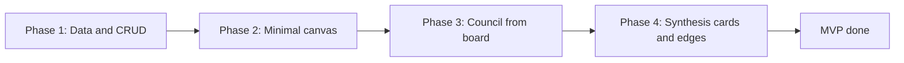

# Council Canvas: 10/10 Execution Plan

**Version:** 1.0  
**Status:** Ready for execution  
**North star:** One workspace that merges Poppy-style canvas + Heptabase-style connections + council as the only AI engine.

---

## 1. Product model (why this is the right plan)

We are building **one product**, not a Heptabase or Poppy clone. Council is the differentiator.

| From Poppy | From Heptabase | Council differentiator |
|------------|----------------|-------------------------|
| Infinite canvas; dump videos, PDFs, links, voice notes | Cards as first-class objects; connect with lines; cluster by theme | Every AI action = **multi-model deliberation** (Stage 1 → Stage 2 → Stage 3). No single-model black box. |
| AI that summarizes, extracts insights, answers "about" your sources | Long-term thinking; meaningful connections; PKM and research | Council runs **over** your board. Output is a synthesis card expandable to who said what and how they ranked. |
| Content generation (scripts, posts, campaigns) from research | Table/board views; tags; structure that scales | Content is generated by **council** with board context. Quality and disagreement are visible. |

**Focus order:** (1) Close the loop: board → council with context → result on board. (2) Council visibility on canvas. (3) Rich media. (4) Templates and Heptabase-style depth.

---

## 2. MVP definition (single testable slice)

**MVP = "Council loop on one board."**

**In scope:**

- One board per project (or one global board). Boards list and open from project view (e.g. "Board" tab next to "Chat").
- Card types: **note**, **link**, **file_ref** (upload or pick from project files). No chat→canvas or canvas→chat in MVP.
- Flow: Create board → add note/link/file cards → select cards (or "use full board") → click **"Run council"** → type question (e.g. "Summarize these" / "What are the main themes?") → backend builds context from selected card content (+ file content for file_ref), runs council, returns synthesis → frontend creates **one council_synthesis card** on the board and **edges** from that card to the selected source cards.
- **Council visibility:** Synthesis card is expandable: read-only view of Stage 1 responses, Stage 2 rankings, Stage 3 synthesis.

**Out of scope for MVP:**

- Drag from chat to board; "Add to board" from chat.
- Media beyond note/link/file_ref (no video_ref, audio_ref, YouTube).
- Content templates ("Script from sources", etc.).
- Tagging, clustering, table view.
- Multiplayer / real-time collaboration.

**MVP success criteria (acceptance):**

1. User can create a board, add note/link/file cards, select a subset (or all), run council with that context, and receive one synthesis card linked to the selection.
2. Synthesis card expands to show full deliberation (Stage 1, Stage 2, Stage 3).
3. Existing chat and council behavior in projects is unchanged (no regressions).
4. Board and cards persist across reloads; edges persist.

---

## 3. Phase map and dependencies

| Phase | Scope | Outcome | Done when |
|-------|--------|--------|-----------|
| **1 – Data and CRUD** | Board, Card, Edge models + migration. API: boards CRUD, cards CRUD, edges CRUD. | Persisted boards/cards/edges; no UI. | API tests pass for create board, add/move/delete cards and edges. |
| **2 – Minimal canvas** | Board list (under project or global); single board view with pan/zoom; place note/link/file_ref cards; move cards; draw/delete edges. React Flow or Tldraw. | Usable whiteboard with notes and links. | User can create a board, add/move/connect cards; state persists. |
| **3 – Council from board** | Backend: accept `context_source: { type: 'board', board_id, card_ids[] }` (or full board if empty). Load card + file content; build context; run council; return message shape. Frontend: "Run council" button, prompt input, call API, show result (chat or temp panel). | Council runs with board context. | User can run council from the board and see the answer. |
| **4 – Synthesis cards and edges** | After council response: create council_synthesis card (+ optional per-model cards); edges from synthesis to selected source cards; card expandable to Stage 1/2/3. | Full MVP loop. | All MVP success criteria met. |

**Rough sizing:** Phase 1 (1–2 weeks), Phase 2 (2–3 weeks), Phase 3 (1–2 weeks), Phase 4 (1 week). **MVP total: ~6–8 weeks** (one focused developer).

---

## 4. Data model (backend)

**New entities** in `backend/database/models.py`:

- **Board:** `id`, `user_id`, `project_id` (nullable), `name`, `created_at`, `updated_at`. Optional: `viewport` (JSON) for pan/zoom restore.
- **Card:** `id`, `board_id`, `type` (`note` | `link` | `file_ref` | `council_synthesis` | `council_response` for later), `title`, `content` (text/markdown), `position` (JSON `{x, y}`), `size` (JSON `{w, h}` optional), `source_message_id` (nullable), `source_conversation_id` (nullable), `extra` (JSON: file_id, url, model name, etc.). Index: `(board_id)`.
- **Edge:** `id`, `board_id`, `from_card_id`, `to_card_id`, `type` (`synthesizes` | `derived_from` | `related`). Unique on `(from_card_id, to_card_id, type)`.

Storage: PostgreSQL via existing SQLAlchemy/async. File content referenced via existing file storage; no large blobs in DB. New Alembic migration for `boards`, `cards`, `edges`.

---

## 5. Backend API

**CRUD:**

- Boards: `GET/POST /api/boards`, `GET/PUT/DELETE /api/boards/{id}`. List filter by `project_id`.
- Cards: `GET/POST /api/boards/{board_id}/cards`, `GET/PUT/DELETE /api/boards/{board_id}/cards/{id}`. PATCH for position/size.
- Edges: `GET/POST /api/boards/{board_id}/edges`, `DELETE /api/boards/{board_id}/edges/{id}`.

**Council from board:**

- Extend existing message/council endpoint with `context_source: { type: 'board', board_id, card_ids[] }`. If `card_ids` empty, use full board. Backend: load card contents and file content for file_ref; build context string; run council; return same message/council response shape. Frontend then creates synthesis card and edges.

**Later (post-MVP):** `POST /api/boards/{board_id}/cards/from-message` for chat→canvas.

---

## 6. Frontend (canvas UX)

**Tech:** React Flow (recommended) or Tldraw for infinite pan/zoom, nodes, edges. Custom card nodes for note, link, file_ref, council_synthesis.

**Board placement:** Board as **tab/mode inside project view** (e.g. "Chat" | "Board"). One default board per project or "Create board" from tab.

**Board view:**

- Toolbar: add note, add link, upload file (file_ref); "Run council" (enabled when board has cards).
- Canvas: pan/zoom; create/move/resize cards; add/remove edges (handles on cards).
- Council synthesis card: title + snippet; expand to Stage 1 / Stage 2 / Stage 3 (read-only).

**Run council flow:** Select cards (or "use full board") → "Run council" → prompt modal/inline → submit → show loading → on response, create synthesis card and edges; optionally show full answer in chat or in-card.

---

## 7. Files to add or change

**Backend:**

- `backend/database/models.py`: Board, Card, Edge.
- New migration: `boards`, `cards`, `edges`.
- New router or routes in `backend/main.py`: boards, cards, edges CRUD.
- Council/message endpoint: accept `context_source`, load board context, run council.

**Frontend:**

- New: `BoardList.jsx`, `BoardView.jsx`, `CanvasCard.jsx` (or React Flow wrapper), board API module (e.g. `api/boards.js`).
- Route: e.g. `/project/:projectId/board/:boardId` or `/project/:projectId` with tab "Board".
- `App.jsx` / router: mount board route; project view: add Board tab.

---

## 8. Non-goals (explicit)

- **Not in MVP or first V2:** Real-time multiplayer; native YouTube/TikTok embed; full Notion-like block editor inside cards; automated pipelines (e.g. "when I add a PDF, always summarize").
- **Defer:** Multi-board workflows (e.g. board B consumes output of board A) until after Chat↔canvas.

---

## 9. Risks and mitigations

| Risk | Mitigation |
|------|------------|
| Council context too large | Cap total context length; optional "summarize selected cards first" then "ask about summary." |
| Scope creep | Ship Phase 1–2 first (data + minimal canvas); only then council-from-board. |
| Large board performance | Lazy-load card body when in view; viewport-based loading if needed. |
| Undo/redo | Add undo stack for board actions in Phase 2 or 4; persist last N operations if desired. |
| Regression to chat/council | Manual checklist per phase; optional E2E for existing council flow. |

---

## 10. Post-MVP (V2) order

1. **Chat ↔ canvas:** "Add to board" from chat; "Run council" from chat with board context.
2. **Council visibility polish:** Edge types "synthesis of" / "derived from"; clearer Stage 1/2/3 UX.
3. **Poppy-style media:** video_ref, audio_ref; drag-and-drop; optional transcription/summary.
4. **Content templates:** "Script from sources," "Post ideas"; council + board context → new cards.
5. **Heptabase depth:** Tags, clusters, optional table view.

---

## 11. QA and launch

- **Per phase:** Manual acceptance against "Done when" criteria. Phase 1: API tests for boards/cards/edges.
- **Before MVP sign-off:** One end-to-end happy path (create board → add cards → run council → see synthesis card + edges + expand Stage 1/2/3). Optional: single E2E test (e.g. Playwright).
- **Rollout:** Feature-flag or "Board" tab visible only when board backend is enabled. No breaking changes to existing project/chat UX.

---

## 12. One-page summary

| Item | Detail |
|------|--------|
| **MVP** | Board + note/link/file cards → Run council with selection → synthesis card + edges; expand to Stage 1/2/3. |
| **Phases** | 4 phases to MVP; 5 initiatives in V2. |
| **Success** | Explicit acceptance criteria for MVP and per phase. |
| **Non-goals** | Multiplayer, heavy automation, multi-board workflows in MVP. |
| **Sizing** | ~6–8 weeks to MVP. |
| **Board placement** | Tab inside project view. |
| **Differentiator** | Council as the only AI engine on the canvas; full deliberation visibility. |

This plan is designed to be **executable**, **testable**, and **aligned** with the product vision (Poppy + Heptabase + council) while keeping the first milestone small and shippable.
